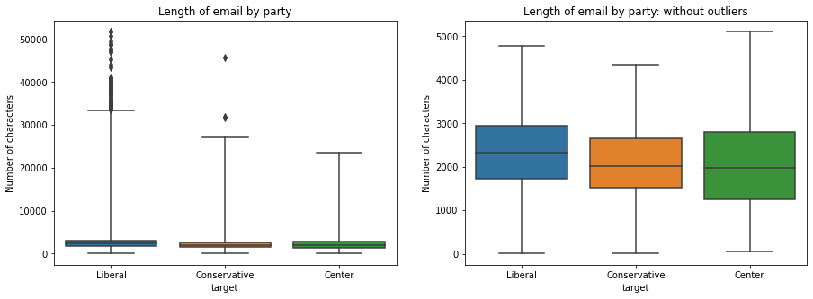

# Political Email Classification

## Introduction
Can a model predict the political ideology of a campaign or PAC from an email? A classification model was created using Natural Language Processing (NLP) and machine learning techniques to answer this question. This repository provides an overview of the data used, modeling approach, and results along with citations and resources. 

## Project Rationale
One way political campaigns and organizations contact voters is through email. A model that predicts the political ideology (liberal-leaning or conservative-leaning) of an email can act as a tool for voters, political campaigns and organizations alike. 

Voters would benefit from this tool by gaining insight to the ideology of a political email they receive. This would be helpful in situations where a political organization, such as a PAC, or a political campaign do not clearly state their political agenda or party affiliation but are asking for financial contributions. 

Political campaigns and organizations would be able to use this tool as a part of their strategic planning for upcoming email campaigns. The model would allow campaigns and organizations to assess if the “tone” of their political-ideology is coming across, or target a specific type of voter. For example, if an organization's goal is to reach a particular type of voter they can assess if their email matches the recipient’s political ideology as a persuasion tactic. 

## Data
This repository replies on data from the Princeton Corpus of Political Emails and OpenSecrets.org. 

To access the Princetion Corpus of Political emails, use [this link](https://docs.google.com/forms/d/e/1FAIpQLSdcgjZo-D1nNON4d90H2j0VLtTdxiHK6Y8HPJSpdRu4w5YILw/viewform) to agree to the terms of data usage and request access to Princeton Corpus of Political Emails  corpus_v1.0. Once approved, download and unzip the `corpus_v1.0.csv` file and move it into the `data/` directory of this repository.

To download the data from OpenSecrets.org, register for access to bulk-data at [this website](https://www.opensecrets.org/bulk-data/signup). Once approved, login to [https://www.opensecrets.org/bulk-data/](https://www.opensecrets.org/bulk-data/) and download [Campaign Finance Data](https://www.opensecrets.org/bulk-data/downloads#campaign-finance) 2020 Cycle Tables. Unzip  and move `cands20.txt`, `cmtex20.txt`, `pac_other20.txt`, and `pacs20.txt` to the `data/` directory of this repository. Finally, download [this table](https://www.opensecrets.org/outsidespending/summ.php?cycle=2020&chrt=V&disp=O&type=A) from OpenSecrets.org (cycle=2020, filter=All types, Spending by Viewpoint=Groups). Save the file as `views.csv` and move it to the `data/` directory of this repository. 

## Exploratory Data Analysis
 The corpus contains contains 317,366 emails from over 3000 political campaigns and organizations in the 2020 election cycle in the US. Emails were classified by political ideology (liberal, conservative, center) which acted as the target variable. Emails originated from political campaigns and political organzations.

  

 The length of emails differed by political ideology. The median length of liberal-leaning emails was higher than the lengths of conservative and center emails respectively. 
 

 Text in the email was processed by removing all non-word characters, tokenizing words, and removing stopwords from the tokens. Which produced the following wordclouds for each of the target variables. 
   
 
## Approach to Modeling
An iterative approach was taken to modeling applying vectorizers to the processed text of the emails and modeling with classifiers. Each model was evaluated for accuracy by calculating an accuracy score, Cohen's Kappa coefficient, and analysis of the model's confusion matrix.  Models were tuned based on the results of these scores. 

 Models included multinomial naive bayes, decision trees, and stochastic gradient descent classifier. The scores of the models were comapred and a final model was selected. 

## Final Model
 A model that uses a CountVectorizer on pre-processed email text and a Stochastic Gradient Descent Classifier to classify  the email as a binary target (liberal or conservative) produced the best result for this probelem. 
 ```
final_model = make_pipeline(CountVectorizer(min_df=0.01),
                            SGDClassifier(random_state=42))
 ```
 This model achieved 98% accuracy score and 0.94 Cohen's Kappa coefficient.
  

 ## Conclusion 
The aim of this project was to create a classification model for political emails. Deployment of this model would allow recipiants of political emails to classify emails from political organizations that did not have a stated political affiliation thereby creating transparence. On the other hand, politial organzations and candidates could use this tool to classify their outgoing email's political-ideology. This could help to strategically plan email campaigns by appealing to target voters or producing emails that align  with their politial ideology. 

There are limitations to the model. This is only applicable to recent political emails in the United States and may not have lasting accuracy as the political landsape changes with time. To combat these limitations, future modeling should include political emails beyond the 2020 Campaign Cycle. Additionally this model was trained using only the email's text. Future modeling should explore including other characteristics of the email such as length, time of day/month/election-cycle sent, number of links within an email, and if the email is personalized to the recipient. 

## Citations
* “Manipulative tactics are the norm in political emails: Evidence from 100K emails from
the 2020 U.S. election cycle”. Arunesh Mathur, Angelina Wang, Carsten Schwemmer,
Maia Hamin, Brandon M. Stewart, and Arvind Narayanan. 2020. Working paper.
https://electionemails2020.org/assets/manipulative-political-emails-working-paper.pdf
* "Follow the Party: Super PACs and the Politial Party Network" Justin Koch. 2019. https://repository.library.georgetown.edu/bitstream/handle/10822/1054947/Koch_georgetown_0076D_14174.pdf
* OpenData.org

